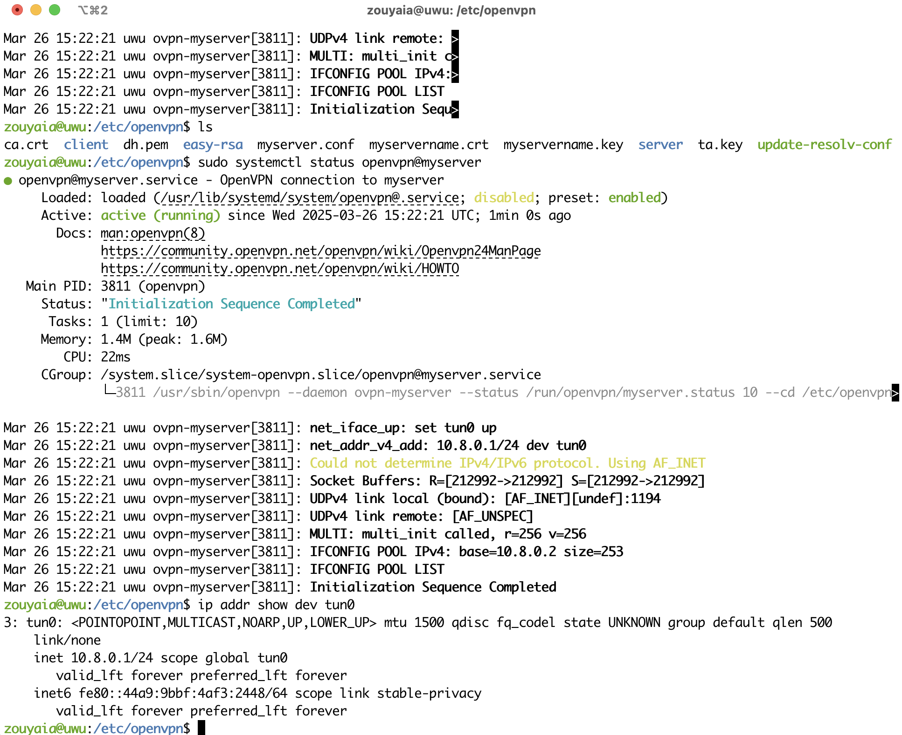

University: [ITMO University](https://itmo.ru/ru/)

Faculty: [FICT](https://fict.itmo.ru)

Course: [Network programming](https://github.com/itmo-ict-faculty/network-programming)

Year: 2024/2025

Group: K3321

Author: Abdulov Ilya Alexandrovich

Lab: Lab1

Date of create: 26.03.2025

Date of finished: 30.03.2025

# Лабораторная работа №1 "Установка CHR и Ansible, настройка VPN"

## Описание

Данная работа предусматривает обучение развертыванию виртуальных машин (VM) и системы контроля конфигураций Ansible а также организации собственных VPN серверов.

## Цель работы

Целью данной работы является развертывание виртуальной машины на базе платформы Microsoft Azure с установленной системой контроля конфигураций Ansible и установка CHR в VirtualBox

## Ход работы

1. Развернем виртуальную машину Ubuntu 24.04 в Selectel

2. Установим Python3 и Ansible

3. Установим CHR on VirtualBox [по инструкции](https://help.mikrotik.com/docs/spaces/ROS/pages/262864931/CHR+installing+on+VirtualBox)

Также установим WinBox:

4. Создадим свой OpenVPN сервер для организации VPN туннеля между сервером автоматизации и локальным CHR.

Следуя [Ubuntu Server documentation раздел OpenVPN](https://documentation.ubuntu.com/server/how-to/security/install-openvpn/index.html) настроим openvpn на сервере. Не забудем выставить в конфиге openvpn сервера протокол tcp.

Выгрузим на роутер клиентские сертификат *client.crt* и ключ *client.key*, они потребуются при настройке далее.

Дальше [настроим OpenVPN клиент на роутере Mikrotik](https://voxlink.ru/kb/voip-devices-configuration/ovpnclientmikrotik/)

Столкнувшись с проблемами при подключении с клиента, находим ошибки в логах openvpn сервера и исправляем ошибки в конфиге сервера и клиента.

### Успешное подключение к серверу

### Пинг от сервера на клиент

### Пинг от клиента на сервер

