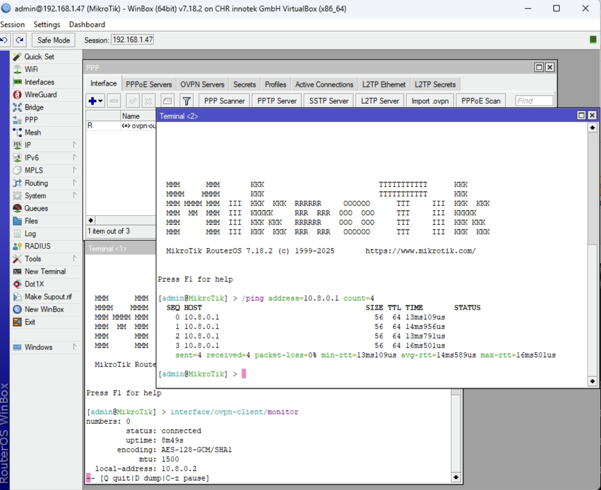
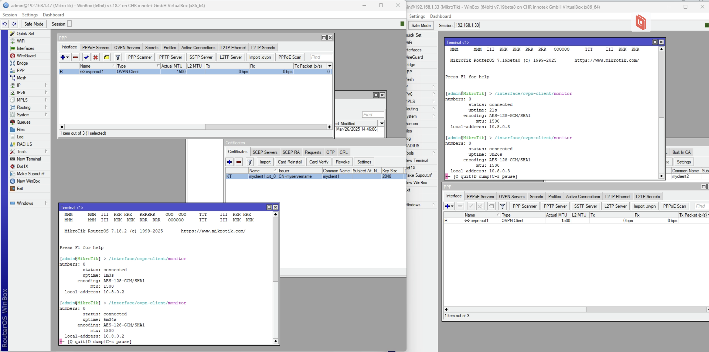
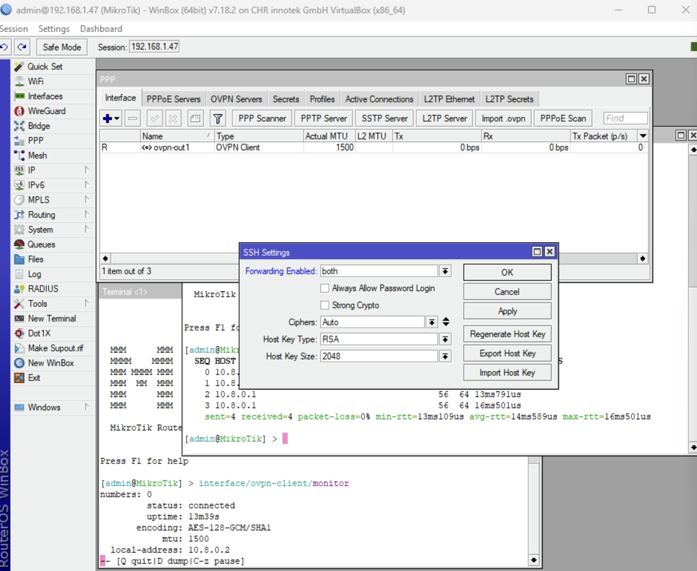
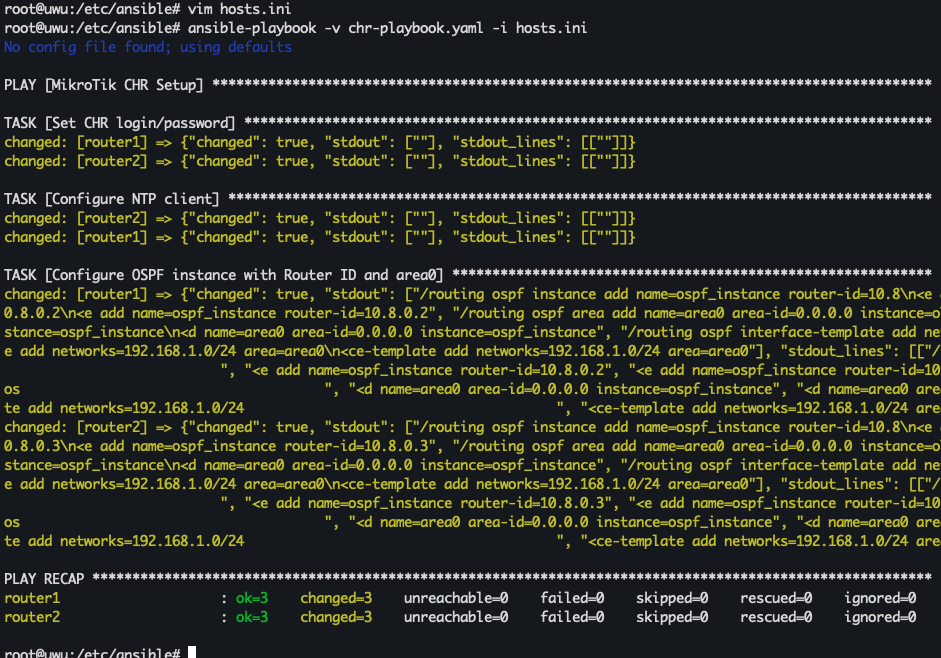
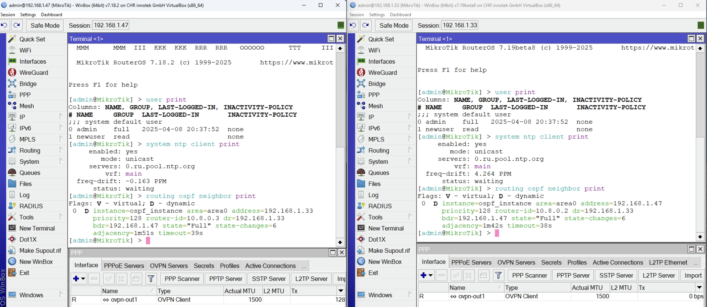
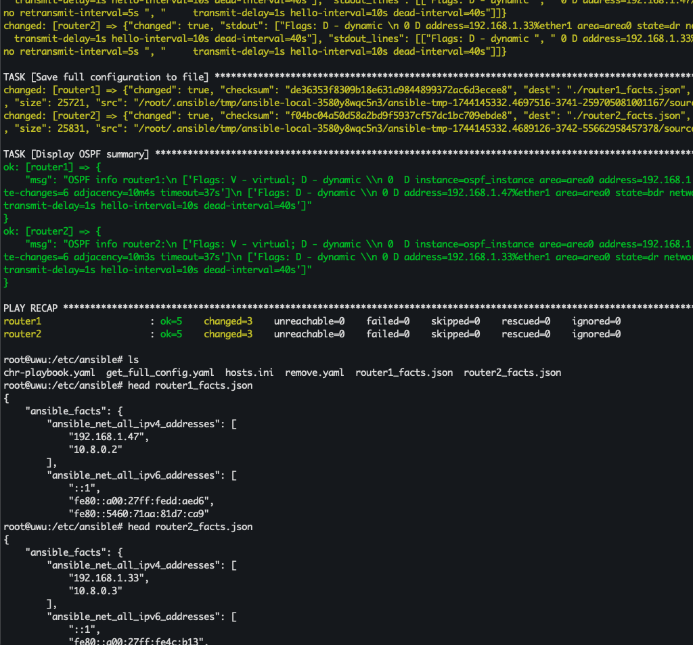
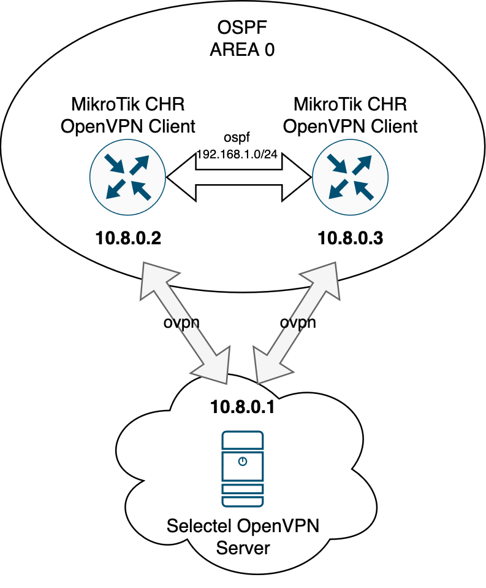
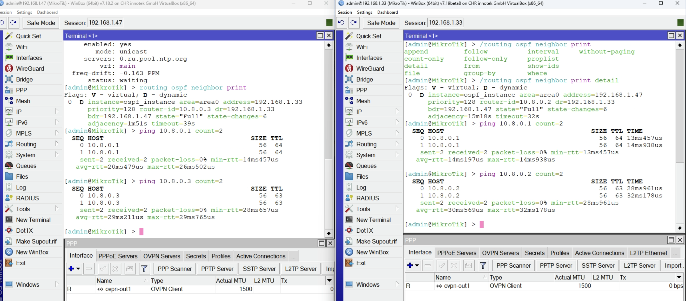
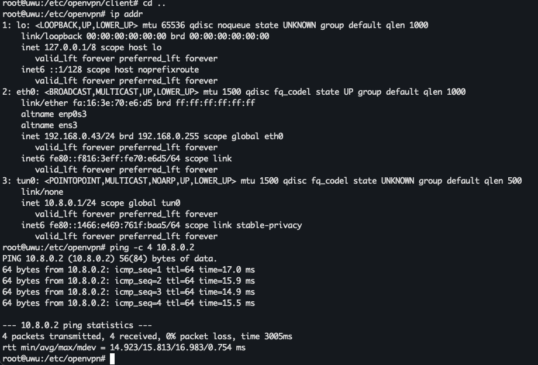

University: [ITMO University](https://itmo.ru/ru/)
Faculty: [FICT](https://fict.itmo.ru)
Course: [Network programming](https://github.com/itmo-ict-faculty/network-programming)
Year: 2024/2025
Group: K3321
Author: Abdulov Ilya Alexandrovich
Lab: Lab2
Date of create: 07.04.25
Date of finished: 09.04.25

# Лабораторная работа №2 "Развертывание дополнительного CHR, первый сценарий Ansible"

## Описание

В данной лабораторной работе вы на практике ознакомитесь с системой управления конфигурацией Ansible, использующаяся для автоматизации настройки и развертывания программного обеспечения.

## Цель работы

С помощью Ansible настроить несколько сетевых устройств и собрать информацию о них. Правильно собрать файл Inventory.

## Ход работы

1. Установим второй CHR на нашем ПК в VirtualBox и организуем OVPN Client на этом устройстве.

Проверим локальную связность CHR с сервером.


Убедимся, что OpenVPN соединение установлено на обоих устройствах.


Установим возможность подключения к CHR по SSH для сценариев ansible.


2. Ansible

```sh
sudo apt install ansible
ansible-galaxy collection install community.routeros
pip install --user ansible-pylibssh --break-system-packages

export ANSIBLE_HOST_KEY_CHECKING=False
```

Настроим сразу на 2-х CHR:

- логин/пароль:
```yaml
# chr-playbook.yaml
- name: MikroTik CHR Setup
  hosts: mikrotik
  gather_facts: no
  tasks:

    - name: Set CHR login/password
      community.routeros.command:
        commands:
          - /user add name=newuser group=read password=pass123
```

```yaml
# hosts.ini
[mikrotik]
router1 ansible_host=10.8.0.2 router_id=10.8.0.2 network=192.168.1.0/24
router2 ansible_host=10.8.0.3 router_id=10.8.0.3 network=192.168.1.0/24

[mikrotik:vars]
ansible_connection = ansible.netcommon.network_cli
ansible_network_os = community.network.routeros
ansible_user = admin
ansible_password = admin
```

- NTP Client:
```yaml
    - name: Configure NTP client
      community.routeros.command:
        commands:
          - /system ntp client set enabled=yes servers=0.ru.pool.ntp.org    
```

- OSPF с указанием Router ID:
```yaml
    - name: Configure OSPF instance with Router ID and area0
      community.routeros.command:
        commands:
          - /routing ospf instance add name=ospf_instance router-id={{ router_id }}
          - /routing ospf area add name=area0 area-id=0.0.0.0 instance=ospf_instance
          - /routing ospf interface-template add networks={{ network }} area=area0
```





Соберем данные по OSPF топологии и полный конфиг устройства используя routeros.facts:

```yaml
- name: Gather CHR Config
  hosts: mikrotik
  gather_facts: no
  tasks:

  tasks:
    - name: Gather facts
      community.routeros.facts:
        gather_subset: all
      register: chr_facts

    - name: Get OSPF neighbors
      community.routeros.command:
        commands:
          - /routing ospf neighbor print detail
      register: ospf_neighbors

    - name: Get OSPF interfaces
      community.routeros.command:
        commands:
          - /routing ospf interface print detail
      register: ospf_interfaces

    - name: Save full configuration to file
      copy:
        content: "{{ chr_facts | to_nice_json }}"
        dest: "{{ inventory_hostname }}_facts.json"
        
    - name: Display OSPF summary
      debug:
        msg: "OSPF info {{ inventory_hostname }}:
        {{ ospf_neighbors.stdout }},
        {{ ospf_interfaces.stdout }}"
```



Полные конфиги [первого CHR](router1_facts.json) и [второго CHR](router2_facts.json).

### Нарисованная схема связи устройств



### Результаты проверки локальной связности




