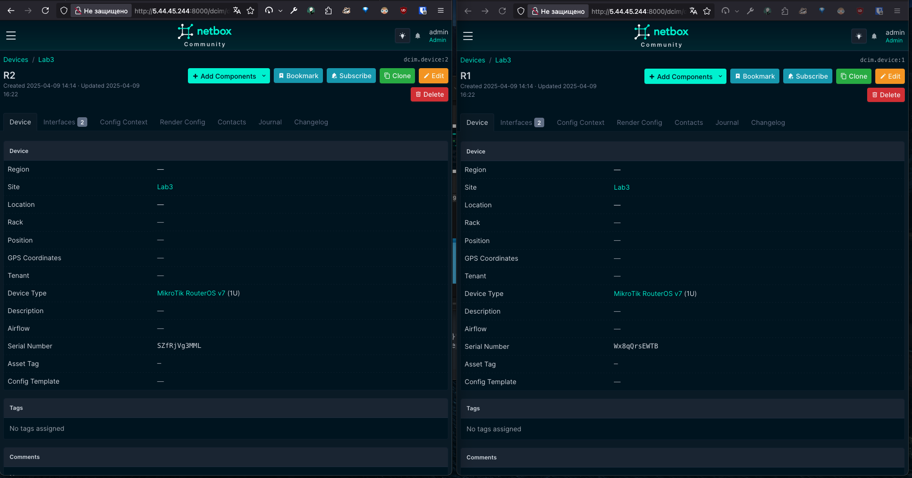

University: [ITMO University](https://itmo.ru/ru/)
Faculty: [FICT](https://fict.itmo.ru)
Course: [Network programming](https://github.com/itmo-ict-faculty/network-programming)
Year: 2024/2025
Group: K3321
Author: Abdulov Ilya Alexandrovich
Lab: Lab3
Date of create: 09.04.25
Date of finished: 18.04.25

# Лабораторная работа №3 "Развертывание Netbox, сеть связи как источник правды в системе технического учета Netbox"

## Описание

В данной лабораторной работе вы ознакомитесь с интеграцией Ansible и Netbox и изучите методы сбора информации с помощью данной интеграции.

## Цель работы

С помощью Ansible и Netbox собрать всю возможную информацию об устройствах и сохранить их в отдельном файле.

## Ход работы

1. Поднимем Netbox на дополнительной VM.

Для этого поставим на новую машину пакеты Git, Docker, containerd, docker-compose, чтобы установить [netbox-docker](https://github.com/netbox-community/netbox-docker).

```sh
git clone -b release https://github.com/netbox-community/netbox-docker.git
cd netbox-docker
tee docker-compose.override.yml <<EOF
services:
  netbox:
    ports:
      - 8000:8080
    environment:
      - no_proxy=localhost
EOF
docker compose pull
docker compose up
```


2. Заполним всю возможную информацию о двух CHR в Netbox.


3. Используя Ansible и роли для Netbox сохраним все данные из Netbox в отдельный файл.

```yaml
# netbox_inventory.yaml
- name: Save Netbox Data
  hosts: localhost
  gather_facts: no
  vars:
    api_endpoint: http://5.44.45.244:8000 # my netbox server endpoint
    token: <insert your token>
  tasks:
  
    - name: Get netbox devices data
      set_fact:
        devices: "{{ query('netbox.netbox.nb_lookup', 'devices', api_endpoint=api_endpoint, token=token, validate_certs=false) }}"

    - name: Save data to file
      copy:
        content:
          - "{{ devices }}"
        dest: devices.json
```

Сохранили данные о netbox устройствах в [devices.json](devices.json).


4. Напишем сценарий, при котором на основе данных из Netbox можно настроить 2 CHR, изменить имя устройства, добавить IP адрес на устройство.

```yaml
- name: Configure CHR using netbox data
  hosts: mikrotik
  gather_facts: no
  vars:
    api_endpoint: http://5.44.45.244:8000
    token: <insert your token>
  tasks:

    - name: Get netbox data
      set_fact:
        devices: "{{ query('netbox.netbox.nb_lookup', 'devices', api_endpoint=api_endpoint, token=token, validate_certs=false) }}"

    - name: Extract router names and ips
      set_fact:
        router1_name: "{{ devices[0].value.name }}"
        router1_ip: "{{ devices[0].value.primary_ip4.address }}"
        router2_name: "{{ devices[1].value.name }}"
        router2_ip: "{{ devices[1].value.primary_ip4.address }}"

    - name: Configure CHR 1 name and ip
      community.routeros.command:
        commands:
          - /ip address add address={{ router1_ip }} interface=ovpn-out1
          - /system identity set name={{ router1_name }}
      when: inventory_hostname == 'router1'

    - name: Configure CHR 2 name and ip
      community.routeros.command:
        commands:
          - /ip address add address={{ router2_ip }} interface=ovpn-out1
          - /system identity set name={{ router2_name }}
      when: inventory_hostname == 'router2'
```


5. Напишем сценарий, позволяющий собрать серийный номер устройства и вносящий серийный номер в Netbox.

```yaml
- name: Get device serial number and reconfigure netbox
  hosts: mikrotik
  gather_facts: false
  vars:
    api_endpoint: http://5.44.45.244:8000
    token: <insert your token>
  tasks:

  - name: Get serial number
    community.routeros.command:
      commands:
        - /system/license/print
    register: sn

  - name: Set facts
    set_fact:
      index: "{{ groups['mikrotik'].index(inventory_hostname) | int }}"
      devices: "{{ query('netbox.netbox.nb_lookup', 'devices', api_endpoint=api_endpoint, token=token, validate_certs=false) }}"

  - name: Reconfigure netbox serial number of device
    netbox_device:
      netbox_url: "{{ api_endpoint }}"
      netbox_token: "{{ token }}"
      validate_certs: false
      data:
        name: "{{ devices[index | int].value.name }}"
        serial: "{{ sn.stdout_lines[0][0] | regex_replace('system-id:', '')}}"
```




### Нарисованная схема связи устройств


### Результаты проверки локальной связности


