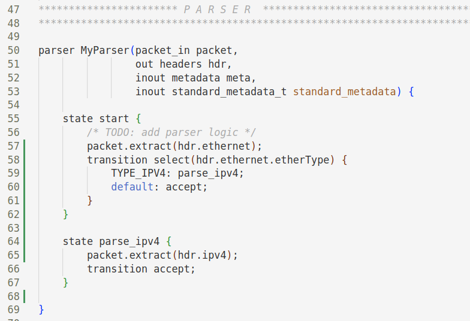
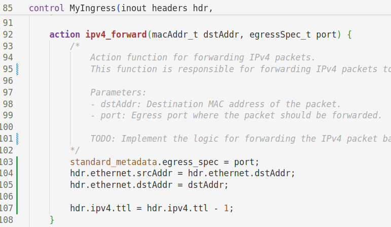
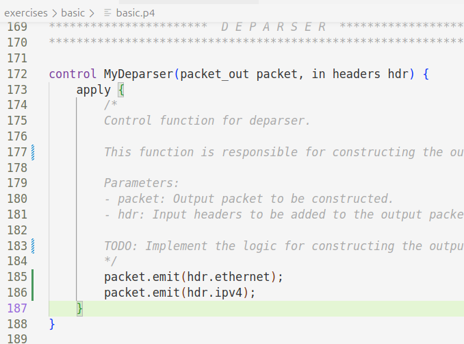
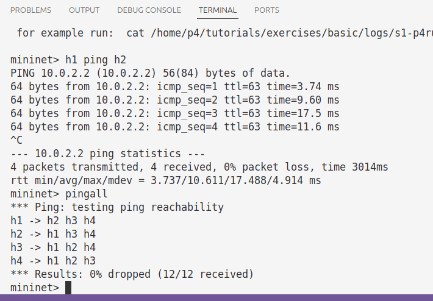
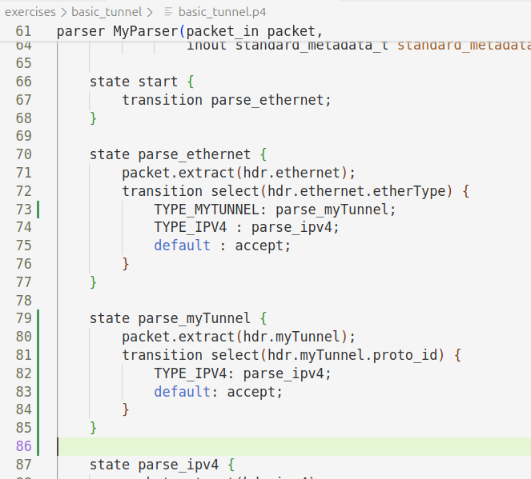
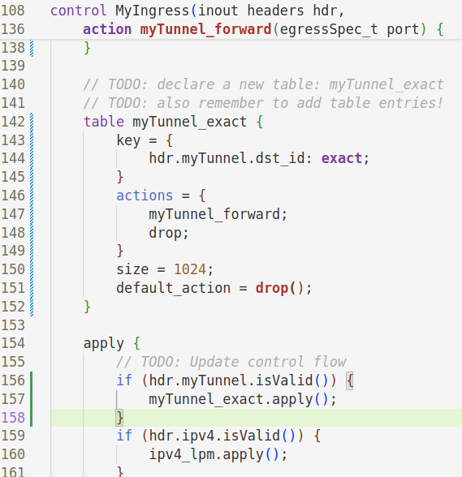
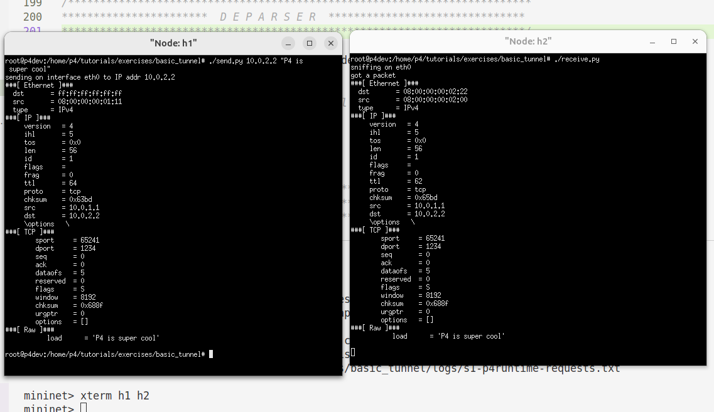
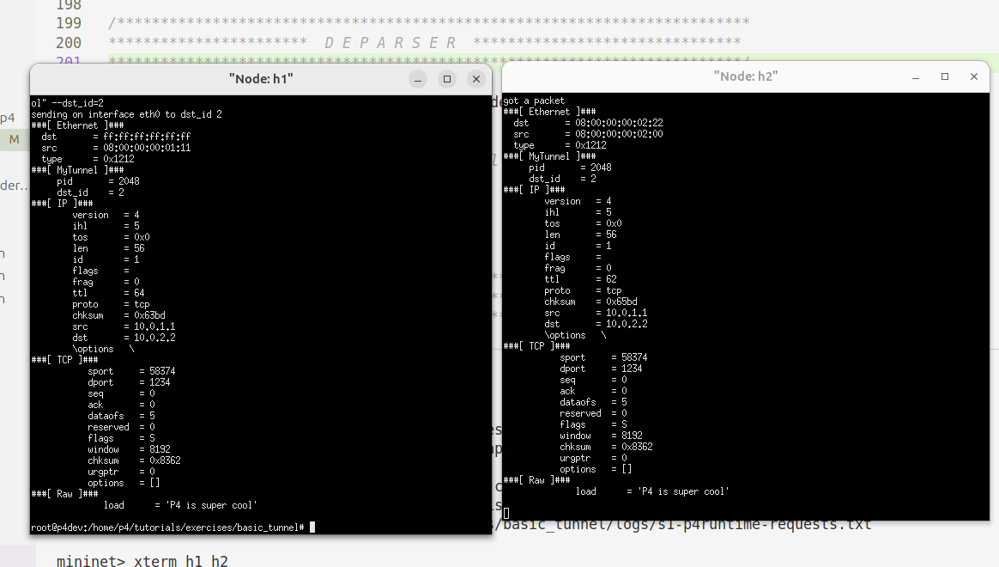
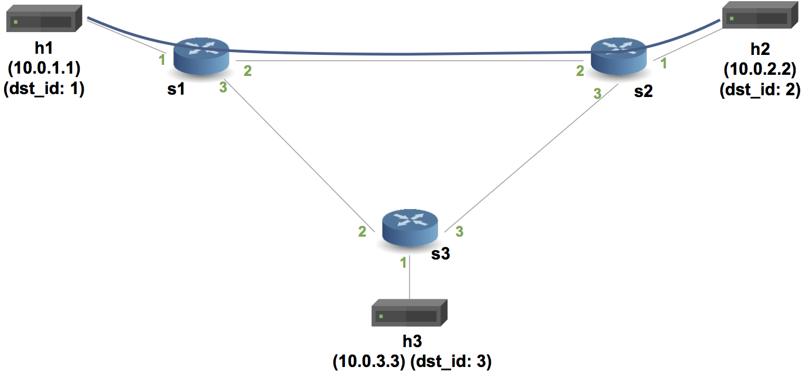

University: [ITMO University](https://itmo.ru/ru/)

Faculty: [FICT](https://fict.itmo.ru)

Course: [Network programming](https://github.com/itmo-ict-faculty/network-programming)

Year: 2024/2025

Group: K3321

Author: Abdulov Ilya Alexandrovich

Lab: Lab4

Date of create: 10.06.25

Date of finished: 

# Лабораторная работа №4 "Базовая 'коммутация' и туннелирование используя язык программирования P4"

## Описание

В данной лабораторной работе вы познакомитесь на практике с языком программирования P4, разработанный компанией Barefoot (ныне Intel) для организации процесса обработки сетевого трафика на скорости чипа. Barefoot разработал несколько FPGA чипов для обработки трафика которые были встроенны в некоторые модели коммутаторов Arista и Brocade.

## Цель работы

Изучить синтаксис языка программирования P4 и выполнить 2 задания обучающих задания от Open network foundation для ознакомления на практике с P4.

## Ход работы

Данную лабораторную работу начнем с изучения [P416 Language Specification](https://p4.org/p4-spec/docs/P4-16-v1.2.3.pdf) для общего представления о языке программирования P4.

Перед выполнением лабораторной работы развернем VM на основе дистро Ubuntu 24.04 с поддержкой инструментов языка P4.

### Базовая переадресация

Цель этого упражнения - написать программу, которая реализует базовую переадресацию для IPv4.

Дополним анализатор для Ethernet и IPv4, который заполняет поля ethernet_t и ipv4_t.

При переадресации по протоколу IPv4 коммутатор должен выполнять следующие действия для каждого пакета: (i) обновлять MAC-адреса источника и назначения, (ii) уменьшать время ожидания (TTL) в заголовке IP и (iii) пересылать пакет на соответствующий порт.

Пропингуем устройства, проверив связность сети.

### Поддержка базового туннелирования

В этом упражнении добавим поддержку базового протокола туннелирования к IP-маршрутизатору, который сделали в прошлом задании.

Базовый коммутатор выполняет переадресацию на основе IP-адреса назначения. Изменим код коммутатора таким образом, чтобы он вместо этого определял порт назначения, используя новый заголовок туннеля.

Обновим синтаксический анализатор, чтобы извлечь либо заголовок myTunnel, либо заголовок ipv4 на основе поля EtherType в заголовке Ethernet.

Определим новую таблицу с именем myTunnel_exact, которая выполняет точное сопоставление с полем dst_id заголовка myTunnel. Выполняется действие myTunnel_forward, если в таблице есть совпадение, иначе действие drop.

Сначала мы протестируем без туннелирования. 

Если изучить полученный пакет, то можно увидеть, что он состоит из заголовка Ethernet, IP-заголовка, TCP-заголовка и сообщения.

Теперь мы тестируем с помощью туннелирования.

Теперь в пакете также присутствует заголовок туннеля.

### Нарисованная схема связи устройств

#### Для первого задания

#### Для второго задания

